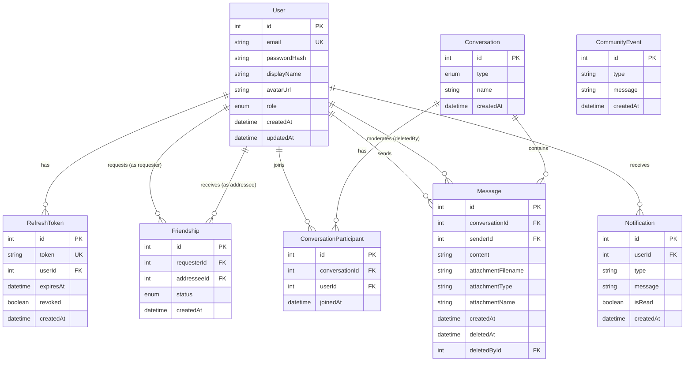

This project has been created as part of the 42 curriculum by vdarsuye, datienza, dmena-li and cochatel.

# Description

## Project concept
Social network for "parishioners": user profiles, hierarchical rank/role system, real-time chat, donations, and later on an LLM-based chatbot (preferred) and a card game (optional).
[Detailed concept and possible features](./docs/concepto.md)

## Who are we ? The «Church of the True Relink»
This isn't just trolling. It's a **counter-cult**.
On one side there's the informal cult that already exists on campus:
- A "correct" Makefile has to react to a `touch Makefile`
- Putting the `Makefile` and all headers into the `.o` dependencies is a sacred ritual
- Whoever doesn't do it is a heretic and the Makefile is considered "non-functional"
- Knowledge is passed on by word of mouth, with no one ever checking the original source

On the other side, there's us.
We take **the same language** (cult, church, true/false, heretics, sacred knowledge) and flip it around. We become the ones who supposedly guard the *true* knowledge of what a relink actually is.

---

## 1. Basic core
- Register / login (JWT + refresh tokens)
- User profile with a "rank" within the Church (Brother, Archbishop of Make, etc.)
- Role and permission system

## 2. Social core
- Friends
- Activity feed

## 4. Communication
- General Church chat
- Private messages
- Themed channels (`#heresies`, `#correct-makefiles`, `#confessions`, `#homilies`)

## 5. Administration and moderation
- Rank management
- Moderation of confessions and posts

## 6. Use of AI 
- To analyse and correct your Makefile
- To moderate the post content

---
# Instructions

### A. Clone the repository

Clone the project to your local machine and access the root directory:
```bash
git clone <YOUR_REPOSITORY_URL>
cd <FOLDER_NAME>
```

### B. Configure environment variables

Each developer must have their own local configuration file. Copy the `.env.example` template file and rename it to `.env`:
```bash
cp .env.example .env
```

⚠️ **Important**: Open the newly created `.env` file and set your own passwords, database credentials, and secret key for tokens (JWT_SECRET). Never commit your personal `.env` file to the repository.

#### 📝 Configuring the `.env` file

When you copy `.env.example` to `.env`, you'll see the following variables. Here's what each one means and what you should change:

| Variable | Default value | What should you do? |
| :--- | :--- | :--- |
| `POSTGRES_USER` | `ft_user` | You can leave this as default for local development. |
| `POSTGRES_PASSWORD` | `change_me` | **CHANGE IT!** Set a secure password for your local database, without special characters like `@ : / # ?` (e.g. `my_super_key_123`). |
| `POSTGRES_DB` | `ft_transcendence`| You can leave this as default. It's the name of the database that will be created automatically in PostgreSQL. |
| `JWT_SECRET` | `change_me_access_secret` | **CHANGE IT!** Generate a long, random string. Used to sign Access Tokens (15 min). |
| `JWT_REFRESH_SECRET` | `change_me_refresh_secret` | **CHANGE IT!** Generate another random string, different from the previous one. Used to sign Refresh Tokens (7 days). |
| `NODE_ENV` | `development` | Leave it as `development` to enable detailed logs and watch mode in NestJS. |
| `VITE_API_URL` | `https://localhost/api` | Leave it as is. This is the URL the Frontend (Vite) will use to communicate with the Backend through Nginx's secure port. |
| `GROQ_API_KEY` | *(empty)* | **REQUIRED AND PERSONAL!** Each developer must generate their own free key — see instructions below. Never share it or commit it to the repository. |
| `GROQ_MODEL` | `openai/gpt-oss-20b` | You can leave this as default. If this model is retired by Groq in the future, change it here without touching the code — check available models at console.groq.com. |

> 🔑 **Tip for generating secure secrets:**
You can quickly generate strong random keys from your terminal by running:
```bash
openssl rand -base64 32
```
Copy the result and paste it into your `JWT_SECRET` and `JWT_REFRESH_SECRET`.

#### 🤖 Get your own Groq API key

**Why everyone needs their own key, not a shared one:**
- **Per-key quota limit**: Groq's free tier has a request limit. If the whole team uses the same key, that quota runs out much faster and people end up blocking each other's work.
- **Security**: a key shared over chat/Slack/whatever is a key that will sooner or later leak by accident. Each key is tied to the account that created it — better that it's your own responsibility, not someone else's.

**How to get one (free, no credit card, 2 minutes):**
1. Go to console.groq.com and create an account or sign in
2. Create a new API key
3. Copy the generated key and paste it into your local `.env` as `GROQ_API_KEY`

### C. Start the project

The `Makefile` automatically detects whether your system uses `docker-compose` (the classic binary, with a hyphen) or `docker compose` (the modern plugin, with a space) — no manual configuration needed for that. It also checks, before running anything else, that Docker is installed and that your user has permission to talk to the daemon; if either of those checks fails, you'll see a message explaining exactly what to do, instead of a cryptic error.

**First time starting the project on a new machine:**
```bash
make first-run
```
This command forces a full rebuild without cache. It's important to use it (instead of `make up`) the first time on each new machine: it prevents Docker from accidentally reusing an old or incomplete dependency-installation layer from a previous attempt, which could leave the backend missing packages that are actually already in `package.json`.

**Day to day, once the project has already been started at least once on that machine:**
```bash
make up
```

**If at any point the project starts behaving strangely** (dependencies that "should be there" but aren't, inconsistent behavior after installing a new package), running `make first-run` again usually fixes it — it rebuilds everything from scratch without relying on any previous cache.

### Makefile command guide

Quick reference for each available command and when to use it.

#### `make` / `make all` / `make up`

The everyday command. Starts all containers, rebuilding them if the code has changed since last time. At the end, it automatically restarts `nginx` — this prevents a `502 Bad Gateway` error that can appear if only one service was rebuilt (e.g. the backend) and nginx kept the old network address for that container. No need to worry about it: it's already handled inside this same command.

```bash
make
```

#### `make first-run`

Use it the first time you start the project on a new computer (or if something is behaving strangely and you suspect a corrupted Docker cache). Rebuilds everything from scratch, without using any previously saved build layer — slower, but guarantees you're not carrying anything over from a failed previous attempt.

```bash
make first-run
```

#### `make down`

Stops all containers without deleting anything — neither the code nor the database data. The next time you run `make up`, everything picks up where you left it.

```bash
make down
```

#### `make logs`

Shows real-time logs from all containers at once. Useful for seeing what's going on without having to stop and restart the project.

```bash
make logs
```

#### `make db-migrate`

Use it after a `git pull` if someone on the team has changed the database schema (`schema.prisma`) and pushed a new migration. Applies migrations that already exist as files in the repository — it doesn't create anything new, it just brings your local database up to date with what others have already defined.

```bash
make db-migrate
```

#### `make db-migrate-dev name=descriptive_name`

Use it when you yourself change `schema.prisma` (add a field, a table, etc.) and need to generate the corresponding migration. Requires a descriptive name — it will be saved as part of the migration file name, so it should briefly explain what's changing.

```bash
make db-migrate-dev name=add_articles
```

#### `make db-studio`

Opens Prisma Studio, a visual browser interface for exploring and editing the database content directly — useful for reviewing data without writing SQL by hand.

```bash
make db-studio
```

#### `make clean`

Stops the containers and deletes the project's volumes — this includes the database. The data is lost, but the already-built Docker images are kept (the next rebuild is faster than with `fclean`).

```bash
make clean
```

#### `make fclean`

Deep clean: in addition to everything `clean` does, it also deletes the project's Docker images. The next time you start the project, everything is rebuilt from scratch.

```bash
make fclean
```

#### `make re`

The "full reset": runs `fclean` and then `all` — deletes absolutely everything (containers, volumes, images) and starts the project up again from scratch, exactly like `first-run`. Use it when you want to start with a clean slate without leaving the Makefile itself.

```bash
make re
```

### Automatic checks when running any command

Before running any of the above rules, the `Makefile` checks two things and warns with a clear message if something fails:

1. **Is Docker installed on this machine?** If not, it shows the installation link.
2. **Does your user have permission to talk to Docker?** If not (typical if you just installed Docker or just added yourself to the `docker` group), it tells you to log out and back in, or to run `newgrp docker` as a quick fix without restarting.

## How to assign the first ARCHBISHOP

This is a one-time bootstrap procedure: changing someone's rank can only be done from the `/sanctuary` panel, but that panel is only accessible to someone who already has the `ARCHBISHOP` rank — so the first `ARCHBISHOP` of each new database (for example, after a `prisma migrate reset`, or when starting the project for the first time on your machine) has to be assigned by hand, directly in the database.

### Step 1 — Register normally in the application

If you don't already have an account in this database, go to the site and register like any brother would — by default, everyone starts with the `BROTHER` rank.

### Step 2 — Find your `id`

```bash
docker compose exec postgres psql -U <POSTGRES_USER> -d <POSTGRES_DB> -c "SELECT id, email, role FROM \"User\";"
```

Replace `<POSTGRES_USER>` and `<POSTGRES_DB>` with the real values from your `.env` file. You'll see a table with all registered users — note down the `id` of your own account (identify it by email).

### Step 3 — Upgrade your rank to `ARCHBISHOP`

```bash
docker compose exec postgres psql -U <POSTGRES_USER> -d <POSTGRES_DB> -c "UPDATE \"User\" SET role = 'ARCHBISHOP' WHERE id = <your_id>;"
```

Replace `<your_id>` with the number you noted in the previous step.

### Step 4 — Log in again

Log out and log back in (or just wait for `/altar` to ask for your credentials again, which happens on every page load). You should now see the "Sanctuary" button.

## From here on

You'll never need to touch the database by hand again — from `/sanctuary` you can change any user's rank (including to `INQUISITOR`) directly from the interface.

> 💡 When you'll need to repeat this process: every time the database is reset from scratch (`prisma migrate reset`, `make clean`, `make fclean`, `make re`) — all ranks are lost along with the rest of the data, so the first `ARCHBISHOP` always has to be created this way.

---

# Resources

# Team information

**vdarsuye:** Product Owner and Lead Developper -> Defines the product vision, prioritizes features, and ensures that the project meets the users' needs. At code level, worked at all levels.
**datienza:** Developper -> Implements the application's features, worked on the front-end.
**dmena-li:** Developper -> In charge of the visual identity, worked on front-end and back-end.
**cochatel:** Project Manager and Developper -> In charge of the organisation, organizing tasks, deadlines, meetings, and ensured that the project stays on track. At code level, worked essentially on the back-end

# Project management

**Organisation:** The team held short meetings every two days to discuss progress, distribute tasks, and address any issues. A longer meeting was held every Friday to review the week's progress and plan the next steps. 
Tasks were distributed among team members according to their roles and areas of expertise. vdarsuye worked across all levels of the application, while datienza focused mainly on front-end development. dmena-li was responsible for the application's visual identity and contributed to both front-end and back-end development. cochatel focused mainly on back-end development while also managing the organization of tasks, deadlines, and meetings. Each member mainly focused on their assigned area while remaining flexible to help with other tasks.

**Tools used:** Github Issues, Figma, Photoshop
**Communication channels used:** WhatsApp

# Technical stack

Frontend: React + TypeScript + Vite + Tailwind CSS
Backend: NestJS + TypeScript
Base de datos: PostgreSQL + Prisma ORM
Tiempo real: Socket.IO
Infraestructura: Docker Compose + Nginx (reverse proxy + HTTPS)

**Why REACT:** It allows us to build an interface using reusable components. It is particularly well-suited for interactive applications where the state of the interface changes frequently.

**Why NestJS and not Express:** the team has 4 people. Express would give us total freedom but no imposed structure — with several developers who have no prior Node experience, that can lead to some architectural complications. NestJS enforces modular organization (Module/Controller/Service/DI), which makes it easier for anyone on the team to understand where each piece belongs.

**Why PostrgreSQL:** PostgreSQL is a robust and mature relational database, particularly well-suited when data has relationships and requires integrity constraints. It is also widely used in the job market, which has allowed us to become familiar with it.

**Why Nginx:** Nginx was chosen as a reverse proxy to provide a single entry point for the application, route requests to the appropriate services, and handle HTTPS. This simplifies the communication between the client, frontend and backend while keeping the internal services isolated

# Database Schema

## Visual representation (Entity-Relationship diagram)



> `CommunityEvent` is not connected to any other table: it is a standalone, ownerless public log (no foreign keys), so it does not appear with relationship lines above.

---

## Tables and their relationships

### `User`
Core account table: authentication data and profile info. This is the hub of the schema — almost every other table points back to it.

- **1 → N with `RefreshToken`**: one user can have many active/expired refresh tokens (multi-device login). `onDelete: Cascade` — deleting a user wipes their tokens.
- **1 → N with `Friendship`** (twice): a user can appear as either the `requester` or the `addressee` of a friendship, hence two named relations (`FriendshipRequester`, `FriendshipAddressee`).
- **1 → N with `ConversationParticipant`**: a user can belong to many conversations (direct chats and channels).
- **1 → N with `Message`** (twice): as the `sender` of a message, and separately as the moderator who soft-deleted someone else's message (`deletedBy`).
- **1 → N with `Notification`**: a user's personal inbox.

### `RefreshToken`
One row per issued refresh token, used to renew JWT access tokens without forcing re-login.

- **N → 1 with `User`**: each token belongs to exactly one user

### `Friendship`
Represents a friend request/relationship between two users. A single row covers the whole lifecycle (`PENDING` → `ACCEPTED`).

- **N → 1 with `User`** (twice): `requester` and `addressee`.
- Unique constraint on `(requesterId, addresseeId)` prevents duplicate requests between the same pair.

### `Conversation`
A chat thread — either a `DIRECT` message (exactly 2 participants) or a `CHANNEL` (many participants, e.g. a shared general chat). `name` is only meaningful for channels.

- **1 → N with `ConversationParticipant`**: the list of members.
- **1 → N with `Message`**: the message history.

### `ConversationParticipant`
Join table linking `User` ↔ `Conversation` (many-to-many, materialized as its own table so it can carry extra data like `joinedAt`).

- **N → 1 with `Conversation`** and **N → 1 with `User`**
- Unique constraint on `(conversationId, userId)` (a user can't join the same conversation twice)

### `Message`
An individual chat message, optionally carrying a file attachment.

- **N → 1 with `Conversation`**: which thread it belongs to.
- **N → 1 with `User`** as `sender` (`Cascade` — if the sender's account is deleted, their messages go with it).
- **N → 1 with `User`** as `deletedBy`, using `SetNull` instead of `Cascade`: if a message is soft-deleted (`deletedAt` set, content hidden behind a tombstone) and the moderator who deleted it later has their account removed, the tombstone stays in place with `deletedById` set to `null` rather than disappearing.
- Attachment fields (`attachmentFilename`, `attachmentType`, `attachmentName`) are all optional since most messages carry no file. `attachmentFilename` is the name on disk; `attachmentName` is the original filename kept for display.

### `Notification`
A personal, targeted notification with read/unread state — the "inbox" half of the notification system.

- **N → 1 with `User`**: belongs to exactly one recipient

### `CommunityEvent`
A public, community-wide chronicle entry. Unlike `Notification`, it has no owner and no read state — it's a shared feed visible to everyone. Some entries mirror real actions (new member joined, rank changed); others are flavor/fictional filler. No foreign keys — fully standalone.

---

## Enums

| Enum | Values | Used by |
|---|---|---|
| `Role` | `HERMANO`, `INQUISIDOR`, `ARZOBISPO` | `User.role` |
| `FriendshipStatus` | `PENDING`, `ACCEPTED` | `Friendship.status` |
| `ConversationType` | `DIRECT`, `CHANNEL` | `Conversation.type` |

---

## Key fields and data types

| Table | Field | Type | Notes |
|---|---|---|---|
| User | id | Int (autoincrement) | Primary key |
| User | email | String | Unique |
| User | passwordHash | String | Hashed, never plaintext |
| User | displayName | String? | Optional |
| User | avatarUrl | String? | Optional |
| User | role | Role | Default `HERMANO` |
| User | createdAt / updatedAt | DateTime | Auto-managed |
| RefreshToken | token | String | Unique |
| RefreshToken | expiresAt | DateTime | Token expiry |
| RefreshToken | revoked | Boolean | Default `false` |
| Friendship | requesterId / addresseeId | Int | FKs to `User`; unique pair |
| Friendship | status | FriendshipStatus | Default `PENDING` |
| Conversation | type | ConversationType | `DIRECT` or `CHANNEL` |
| Conversation | name | String? | Only used for `CHANNEL` |
| ConversationParticipant | conversationId / userId | Int | FKs; unique pair |
| Message | content | String | Message text |
| Message | attachmentFilename / attachmentType / attachmentName | String? | All optional |
| Message | deletedAt | DateTime? | Soft-delete marker |
| Message | deletedById | Int? | FK to `User`, `SetNull` on delete |
| Notification | type | String | Notification category |
| Notification | isRead | Boolean | Default `false` |
| CommunityEvent | type | String | Event category |
| CommunityEvent | message | String | Event text |

# Features list 

# Modules

### Módulo 1 — Web
| Module | Who | Why | How | Points |
|---|---|---|---|---|
| Major: Framework de frontend y backend (React + NestJS) | | | | 2 |
| Minor: framework de frontend (por separado) | | | | — |
| Minor: framework de backend (por separado) | | | | — |
| Major: Funcionalidades en tiempo real (WebSockets) | | | | 2 |
| Major: Interacción entre usuarios (chat, perfil, amigos) | | | | 2 |
| Minor: ORM (Prisma) | | | | 1 |
| Minor: Sistema completo de notificaciones | | | | 1 |
| Minor: PWA con soporte offline e instalabilidad | | | | 1 |
| Minor: Design system propio (10+ componentes) | | | | 1 |
| Minor: Sistema de subida y gestión de archivos | | | | 1 |
| Subtotal Web | - | - | - | 11 |

---

### Módulo 2 — Accessibility and Internationalization
| Module | Who | Why | How | Points |
|---|---|---|---|---|
| Major: Cumplimiento WCAG 2.1 AA completo | | | | 2 |
| Minor: Soporte multi-idioma (3+ idiomas, i18n, selector) | | | | 1 |
| Minor: Soporte RTL | | | | 1 |
| Minor: Compatibilidad con navegadores adicionales | | | | 1 |
| Subtotal Accessibility/i18n | - | - | - | 5 |

---

### Módulo 3 — User Management
| Module | Who | Why | How | Points |
|---|---|---|---|---|
| Major: Gestión estándar de usuario (perfil editable, avatar con default, amigos + estado online, página de perfil) | | | | 2 |
| Minor: Autenticación remota OAuth 2.0 | | | | 1 |
| Major: Sistema de permisos avanzado (CRUD de usuarios, gestión de roles, vistas/acciones según rol) | | | | 2 |
| Major: Sistema de organizaciones (crear/editar/eliminar, añadir/quitar usuarios, acciones dentro de la organización) | | | | 2 |
| Minor: 2FA completo | | | | 1 |
| Minor: Panel de analíticas de actividad de usuario | | | | 1 |
| Subtotal User Management | - | - | - | 9 |

---

### Módulo 4 — Artificial Intelligence
| Module | Who | Why | How | Points |
|---|---|---|---|---|
| Major: Interfaz completa de sistema LLM (texto/streaming, manejo de errores, rate limiting) | | | | 2 |
| Minor: Moderación de contenido por IA | | | | 1 |
| Subtotal AI | - | - | - | 3 |

---

# Individual contributions
